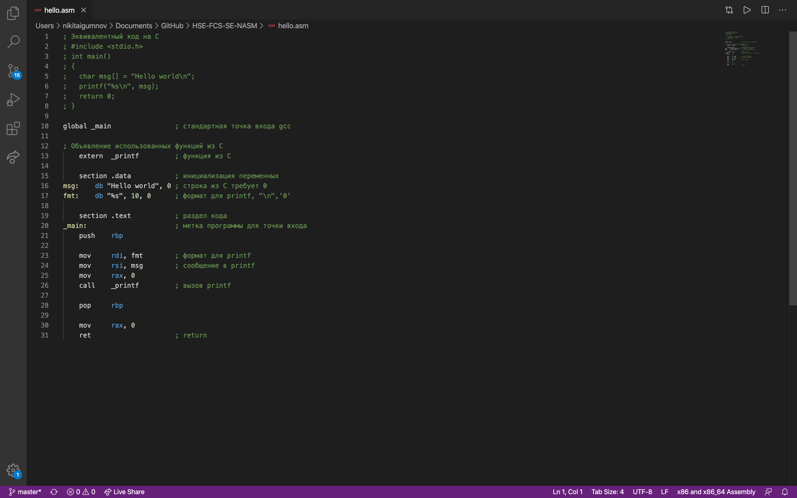
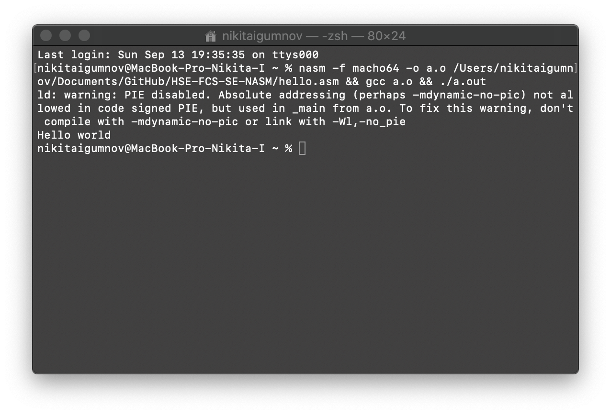
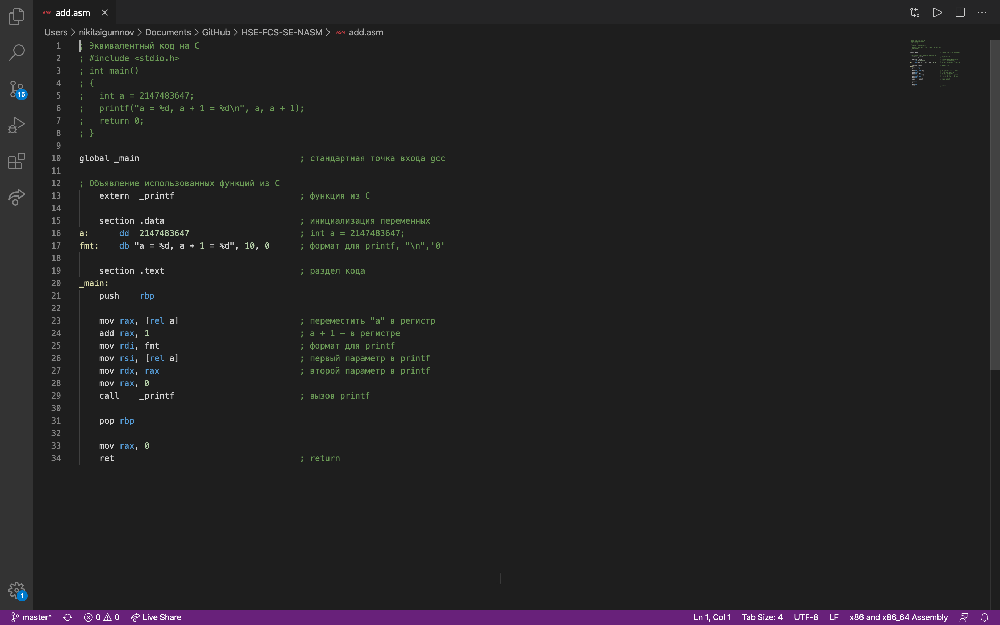
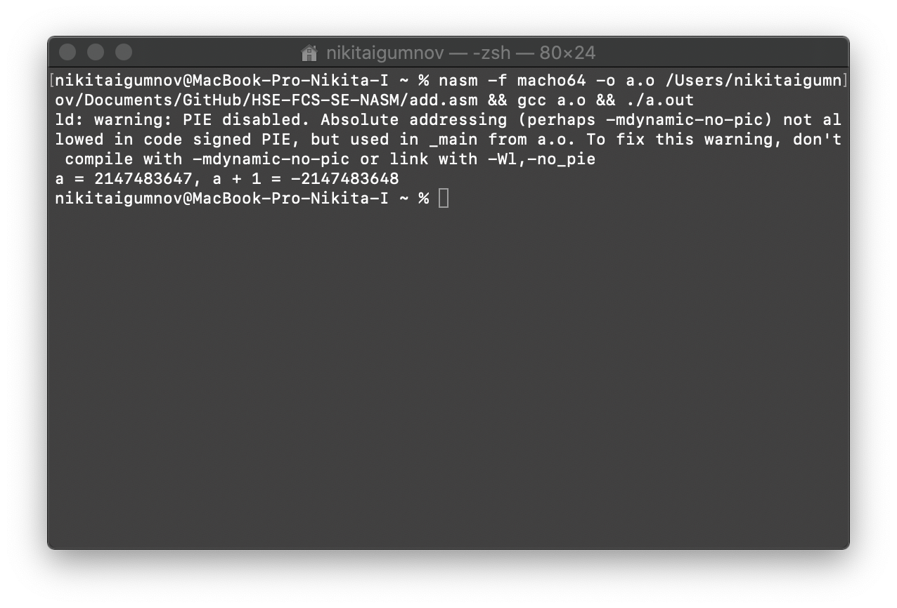
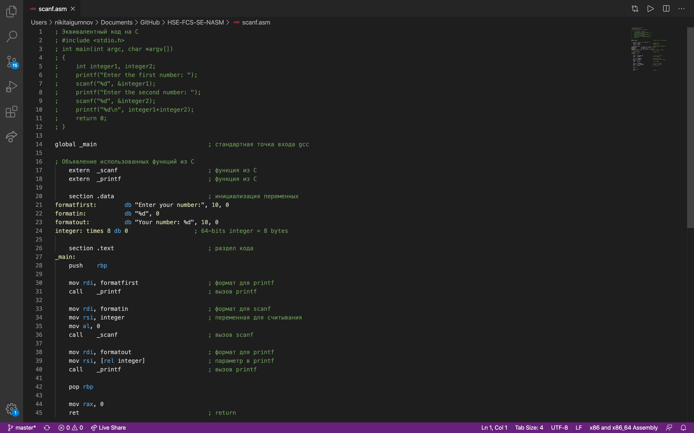
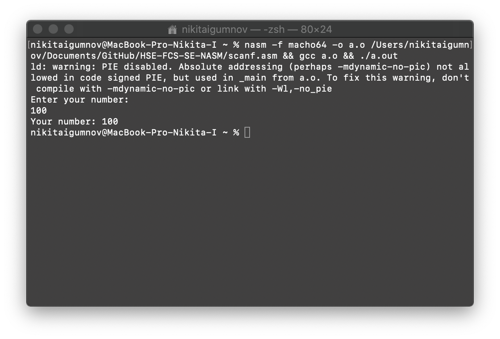
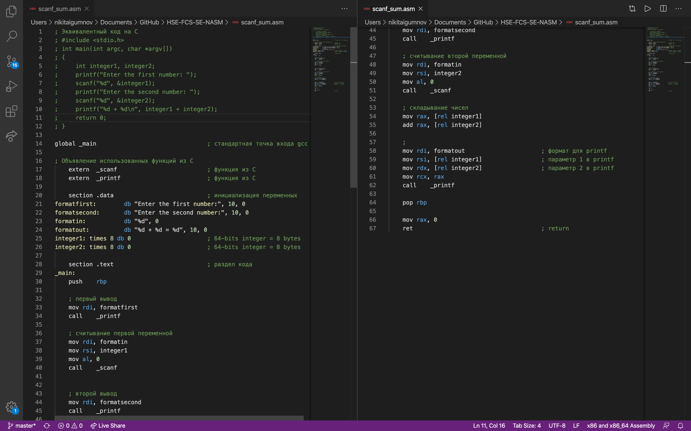
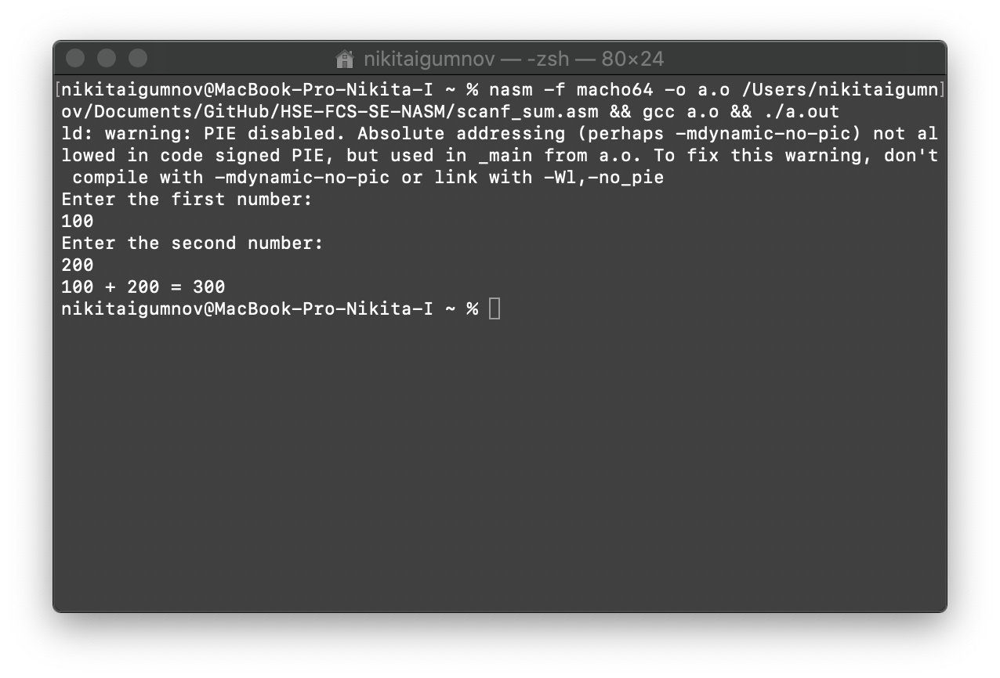
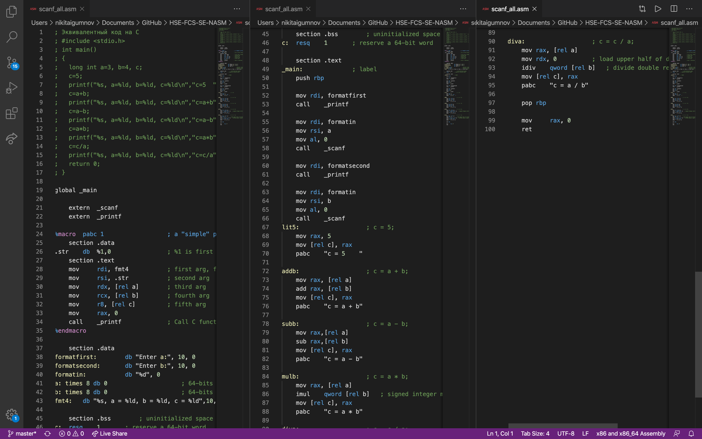
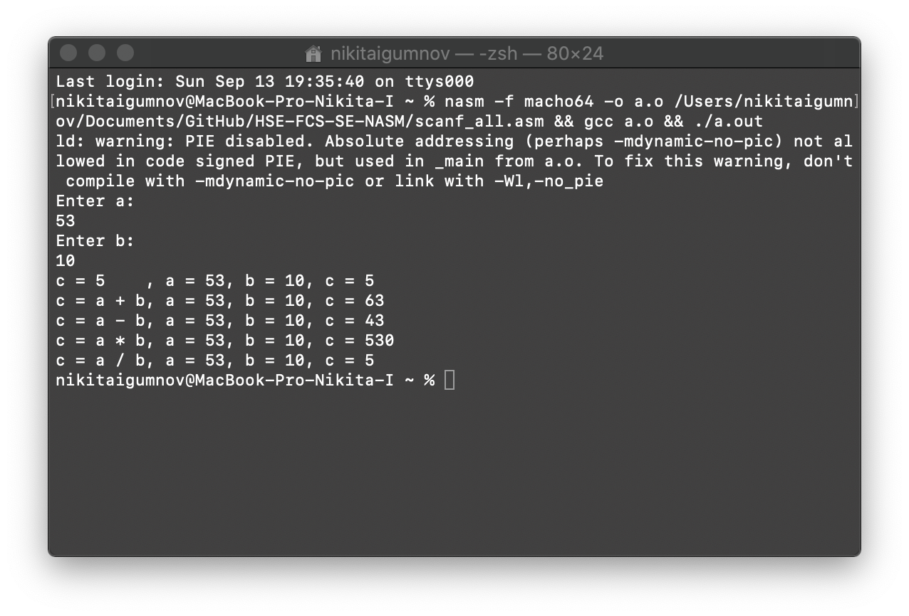

## Игумнов Никита, БПИ191
[В данной папке](https://github.com/NikitaChampion/HSE-FCS-SE-NASM/tree/master/HW1) представлено выполнение первой домашней работы по работе с NASM.

## 1 программа – работа с выводом в консоль

Программа, выводящая в консоль строку "Hello World".

- **Код программы** 
   

- **Результат выполнения после запуска программы в консоли** 
   
---

## 2 программа – работа со сложением

Программа, добавляющая к максимальному int-овому числу 1. Как и в C происходит переполнение и возвращается минимальное int-овое число.
Результат выводится в консоль.

- **Код программы** 
   
  
- **Результат выполнения после запуска программы в консоли** 
   
---

## 3 программа – работа со считыванием числа

Программа считывает число, введённое пользователем и выводит его на экран. 

- **Код программы** 
   
  
- **Результат выполнения после запуска программы в консоли** 
   
---

## 4 программа

Программа считывает два целых числа с консоли и выводит их сумму на экран.

- **Код программы** 
   

- **Результат выполнения после запуска программы в консоли** 
   
---

## 5 программа

Программа считывает два целых числа с консоли и выводит результаты их сложения, вычитания, деления и умножения.

- **Код программы** 
   

- **Результат выполнения после запуска программы в консоли** 
   
---

## Использованная литература / интернет источники
1. Программирование на языке ассемблера NASM для ОС UNIX / А. В. Столяров – МАКС Пресс, 2011. – 188 С.

2. Sample 64-bit nasm programs [Электронный ресурс]. Режим доступа: https://www.csee.umbc.edu/portal/help/nasm/sample_64.shtml, свободный. (дата обращения: 13.09.2020)

3. How to use scanf in NASM [Электронный ресурс] / Stack Overflow. Режим доступа: https://stackoverflow.com/questions/10973650/how-to-use-scanf-in-nasm, свободный. (дата обращения: 13.09.2020)
